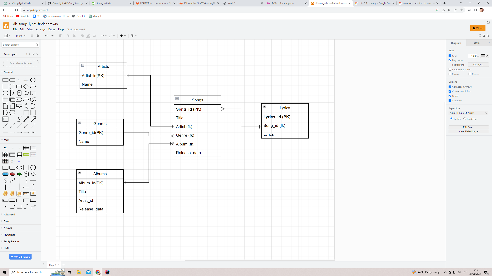

# ics0014-spring2023-project

# Song Lyrics Finder

### Overview
The Song Lyrics Finder is a Java application that allows users to search for song lyrics based on song titles as well as words or sentences from a song. It provides a simple and convenient way to find and retrieve the lyrics of various songs.

### Features
The following guides illustrate how to use some features concretely:

* Search Functionality: Users can search for song lyrics based on song titles. Additionally, they can enter specific words or sentences from a song to find matching songs that contain those lyrics.
* User-Friendly Interface: The application provides an easy-to-use interface that prompts users to enter a song title or lyrics and displays the matching songs in a clear and readable format.
* Extensible: The app can be further extended to support additional features such as autocomplete suggestions, filtering by genre or artist, or displaying additional information about the songs or artists.



## Getting started

To make it easy for you to get started with GitLab, here's a list of recommended next steps.

Already a pro? Just edit this README.md and make it your own. Want to make it easy? [Use the template at the bottom](#editing-this-readme)!

## Add your files

- [ ] [Create](https://docs.gitlab.com/ee/user/project/repository/web_editor.html#create-a-file) or [upload](https://docs.gitlab.com/ee/user/project/repository/web_editor.html#upload-a-file) files
- [ ] [Add files using the command line](https://docs.gitlab.com/ee/gitlab-basics/add-file.html#add-a-file-using-the-command-line) or push an existing Git repository with the following command:

```
cd existing_repo
git remote add origin https://gitlab.cs.ttu.ee/arroba/ics0014-spring2023-project.git
git branch -M main
git push -uf origin main
```

## Integrate with your tools

- [ ] [Set up project integrations](https://gitlab.cs.ttu.ee/arroba/ics0014-spring2023-project/-/settings/integrations)

## Collaborate with your team

- [ ] [Invite team members and collaborators](https://docs.gitlab.com/ee/user/project/members/)
- [ ] [Create a new merge request](https://docs.gitlab.com/ee/user/project/merge_requests/creating_merge_requests.html)
- [ ] [Automatically close issues from merge requests](https://docs.gitlab.com/ee/user/project/issues/managing_issues.html#closing-issues-automatically)
- [ ] [Enable merge request approvals](https://docs.gitlab.com/ee/user/project/merge_requests/approvals/)
- [ ] [Automatically merge when pipeline succeeds](https://docs.gitlab.com/ee/user/project/merge_requests/merge_when_pipeline_succeeds.html)


